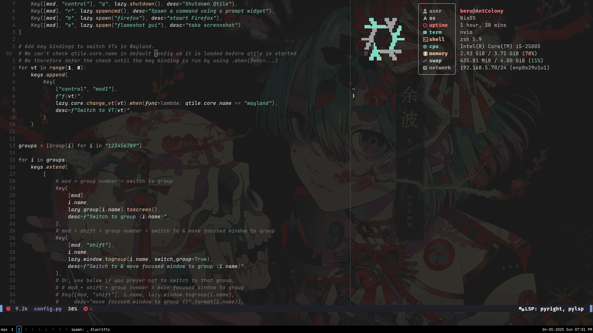

[](https://wakatime.com/badge/user/0d75cfc5-da70-41b7-b8c8-661ef9d8338b/project/9358976a-67c2-4357-8140-bd4a4c743b96)

# [#] Dotfiles

Personal dotfiles setup for managing Neovim, Fastfetch, Starship, zsh, tmux and more — using `stow` for clean symlinks and `make` for convenience.

## [+] Pre-requisites

Make sure your system has:

- git
- stow
- zsh
- Neovim (v0.9 or higher)
- Fastfetch
- Starship
- tmux

Additional tools for LSP / Development:

- Go
- Clang
- gcc
- Python
- Node.js
- Rust

## Directory Structure

```
dotfiles/
│
├── alacritty/          → Alacritty config
├── fastfetch/          → Fastfetch config
├── nvim/               → Neovim config
├── tmux/               → tmux config
├── zsh/                → zsh config
│
├── scripts/
│   ├── install.sh      → setup installer
│   └── start_tmux.sh   → tmux script
│
├── Makefile            → run scripts using make
└── README.md
```

## [>>] Installation

> [!WARNING]\
> Under _**active development**_ — Existing config files will be overwritten!

```
git clone https://github.com/dracuxan/Dot-Files.git ~/dotfiles && cd ~/dotfiles
```

### [::] Make Commands to Complete the installation

| Command      | Description                                         |
| ------------ | --------------------------------------------------- |
| make install | runs `install.sh` — Installs by using stow          |
| make setup   | copies the script `start_tmux.sh` to /usr/local/bin |
| make clean   | unstows (removes) all symlinked configs             |

## Screenshots




